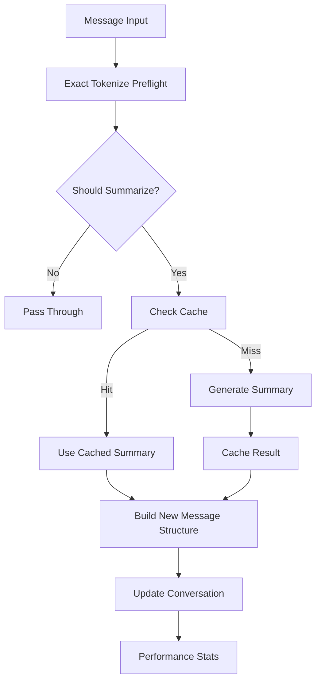

# 📝 Summarizer

> **Intelligent conversation management for Open WebUI with advanced summarization capabilities**

[](https://github.com/open-webui/functions)
[](https://github.com/open-webui/open-webui)
[](LICENSE)

---

## 🌟 Overview

**Enhanced Conversation Summarizer** is an Open WebUI filter that automatically compacts older conversation history while preserving a recent tail for continuity. It prefers exact provider-side `/tokenize` preflight to decide when to summarize and only falls back to a flat turn threshold when exact tokenization is unavailable.

### ✨ Key Features

- 🎯 **Exact Token Triggering** - Uses provider-side `/tokenize` counts when available
- 🎛️ **Model Selection** - Choose specific models for summarization or use current conversation model
- ⚡ **Performance Optimized** - Smart caching and targeted compaction planning
- 🎯 **Quality Modes** - Quick, Balanced, or Detailed summarization based on your needs
- 📊 **State Recovery** - Mid-conversation enablement handling and stored-summary replay
- 🔧 **Provider-Aware Configuration** - Separate settings for summary self-calls and tokenizer preflight
- 🐛 **Debug & Monitoring** - Extensive logging and performance statistics
- 💾 **Reliable Operation** - Graceful error handling plus a flat turn-count fallback

---

## 🚨 Important: Getting Started

> **⚠️ RECOMMENDED:** Enable debug mode during initial setup to monitor filter operation and fine-tune settings. The filter works immediately after installation but can be optimized for your specific use case.

---

## 📋 Table of Contents

- [🚀 Quick Start](#-quick-start)
- [🏗️ Installation](#️-installation)
- [🎯 Core Concepts](#-core-concepts)
  - [Smart Detection System](#smart-detection-system)
  - [Quality Modes](#quality-modes)
  - [Model Selection](#model-selection)
- [🛠️ Configuration](#️-configuration)
  - [Core Settings](#core-settings)
  - [Advanced Options](#advanced-options)
  - [Performance Tuning](#performance-tuning)
- [💡 Usage Guide](#-usage-guide)
  - [Basic Operation](#basic-operation)
  - [Testing & Debugging](#testing--debugging)
  - [Optimization Tips](#optimization-tips)
- [🏗️ System Architecture](#️-system-architecture)
  - [Processing Pipeline](#processing-pipeline)
  - [Caching System](#caching-system)
  - [Performance Monitoring](#performance-monitoring)
- [🔧 Troubleshooting](#-troubleshooting)
- [🚀 Advanced Features](#-advanced-features)
- [🤝 Contributing](#-contributing)

---

## 🚀 Quick Start

### 1️⃣ Install the Filter
1. Copy the complete filter code from the artifacts
2. Add as a new filter in Open WebUI (Admin Panel → Functions)
3. Enable the filter for your desired models or globally

### 2️⃣ Basic Configuration
```yaml
# Recommended starting settings
tokenizer_api_base_url: "http://your-vllm-host:8000"  # Exact /tokenize endpoint root
summary_trigger_turns: 6                              # Flat fallback if /tokenize is unavailable
summary_trigger_percent: 70                           # Summarize at 70% of model capacity
summary_target_percent: 45                            # Compact to about 45% of model capacity
preserve_recent_turns: 4                              # Keep at least 4 recent turns unsummarized
summary_quality: "balanced"                           # Use balanced quality mode
summary_model: "auto"                                # Use current conversation model
enable_debug: true                                    # Enable debugging initially
```

### 3️⃣ Test the System
1. Set `tokenizer_api_base_url` to your inference server root if it exposes `/tokenize`
2. Start a conversation large enough to cross your configured token threshold, or use `force_summarize_next: true`
3. Check console logs for detailed operation info
4. Confirm status messages mention exact tokens when tokenization is available

### 4️⃣ Monitor & Optimize
- Review debug logs to confirm exact-token decisions vs fallback turn decisions
- Adjust trigger/target percentages based on your model capacity
- Experiment with different `summary_quality` modes
- Adjust `summary_trigger_turns` only as a fallback behavior

---

## 🏗️ Installation

### Prerequisites
- Open WebUI instance with filter support
- Administrator access to add filters
- Models available for conversation and summarization

### Step-by-Step Installation

1. **Access Filter Management**
   - Navigate to Open WebUI Admin Panel
   - Go to Workspace → Functions
   - Click "Add Function" or import option

2. **Install Conversation Summarizer**
   - Copy the complete filter code
   - Paste into the function editor
   - Set function name: "Enhanced Conversation Summarizer"
   - Save and enable the function

3. **Configure Filter Assignment**
   - Go to Workspace → Models
   - Assign the filter to specific models, or
   - Enable globally via Workspace → Functions (Global toggle)

4. **Initial Configuration**
   - Review valve settings in the function configuration
   - Enable `enable_debug: true` for initial testing
   - Set `test_mode: true` for extra status messages
   - Configure `summary_model` if using different model for summarization

5. **Verification**
   - Start a test conversation
   - Send enough messages to cross your token threshold, or force one summary with `force_summarize_next: true`
   - Watch for summarization status messages
   - Check console logs for debug information

---

## 🎯 Core Concepts

### Smart Detection System

The trigger path is deterministic:

#### 🧠 What It Checks
- **Exact Prompt Tokens**: Calls the provider's `/tokenize` endpoint with the outbound chat payload when configured
- **Model Capacity**: Uses `max_model_len` returned by `/tokenize` when the provider exposes it
- **Existing Summaries**: Detects previously injected summary messages to avoid duplication
- **Conversation Tail**: Preserves the configured number of recent turns after compaction

#### 🔄 How It Works
- **Primary Path**: Exact `/tokenize` decides whether the current request is over the configured trigger percentage
- **Compaction Planning**: Candidate compacted payloads are checked with exact tokenization when available
- **Fallback Path**: If `/tokenize` is unavailable or fails, summarization falls back to `summary_trigger_turns`
- **State Replay**: Stored summarized prefixes are reapplied so later requests stay in sync

### Quality Modes

Choose the right summarization approach for your needs:

| Mode | Speed | Detail | Use Case |
|------|-------|--------|----------|
| **Quick** | ⚡ Fast | 📄 Basic | Simple conversations, fast processing |
| **Balanced** | ⚖️ Medium | 📊 Good | General use, optimal balance |
| **Detailed** | 🐌 Slower | 📚 Rich | Complex technical discussions, comprehensive context |

#### 📋 Quality Mode Features
- **Quick**: Main topics, basic context, ~250 characters
- **Balanced**: Key questions, technical terms, important details, ~500 characters  
- **Detailed**: Comprehensive coverage, decisions, full technical context, ~800 characters

### Model Selection

#### 🎛️ Model Configuration Options
```yaml
summary_model: "auto"              # Use current conversation model
summary_model: "llama3.2:3b"      # Use specific lightweight model
summary_model: "qwen2.5:1.5b"     # Use fast, efficient model
summary_model: "gpt-3.5-turbo"    # Use cloud model for summarization
```

#### 💡 Model Selection Benefits
- **Performance**: Use faster models for background summarization
- **Cost Efficiency**: Use cheaper models for the summarization task
- **Specialization**: Some models excel at summarization vs conversation
- **Resource Management**: Distribute computational load

---

## 🛠️ Configuration

### Core Settings

#### 🎛️ Essential Configuration
| Setting | Default | Description |
|---------|---------|-------------|
| `tokenizer_api_base_url` | `""` | Base URL for exact `/tokenize` preflight calls |
| `tokenizer_api_key` | `""` | Optional API key for `/tokenize` preflight calls |
| `summary_trigger_turns` | `6` | Fallback minimum turns before summarization when exact tokenization is unavailable |
| `preserve_recent_turns` | `4` | Minimum number of recent turns to keep unsummarized |
| `max_context_tokens` | `32768` | Fallback context limit when `/tokenize` does not return model capacity |
| `summary_trigger_percent` | `70` | Trigger compaction at this percentage of model capacity |
| `summary_target_percent` | `45` | Target this percentage of model capacity after compaction |
| `estimated_chars_per_token` | `4.0` | Diagnostic-only approximation used in debug logging |
| `summary_model` | `"auto"` | Model for summarization (`"auto"` or specific model name) |
| `summary_quality` | `"balanced"` | Summary quality: `"quick"`, `"balanced"`, or `"detailed"` |
| `priority` | `0` | Filter execution priority (lower = higher priority) |

#### 🧠 Request Routing Settings
| Setting | Default | Description |
|---------|---------|-------------|
| `summary_api_base_url` | `""` | Optional Open WebUI base URL override for summary self-calls |
| `summary_api_key` | `""` | Optional API key for summary self-calls |
| `summary_api_timeout_seconds` | `60` | Timeout for `/api/chat/completions` and `/tokenize` HTTP calls |
| `force_summarize_next` | `false` | Force summarization on the next message, then reset |

### Advanced Options

#### ⚡ Performance Settings
```yaml
enable_caching: true                    # Cache summaries for performance
summary_api_base_url: ""               # Optional Open WebUI base URL override for summary self-calls
summary_api_key: ""                    # Optional API key override for summary self-calls
tokenizer_api_base_url: ""             # Base URL for provider-side exact /tokenize
tokenizer_api_key: ""                  # Optional API key override for /tokenize
summary_api_timeout_seconds: 60         # Timeout for both summary and tokenize HTTP calls
summary_max_chars_quick: 250            # Hard cap for quick summaries
summary_max_chars_balanced: 500         # Hard cap for balanced summaries
summary_max_chars_detailed: 800         # Hard cap for detailed summaries
```

#### 🔧 Testing & Debug
```yaml
enable_debug: true                     # Enable comprehensive debug logging
test_mode: true                        # Extra status messages for testing
force_summarize_next: false           # Force summarization on next message
```

### Performance Tuning

#### 🚀 Optimization Features
- **Smart Caching** - Avoids regenerating identical summaries
- **Exact Preflight** - Uses provider token counts instead of heuristic trigger decisions
- **Efficient Compaction** - Preserves only the recent tail needed after summarization
- **Deterministic Fallback** - Uses a flat turn threshold when exact tokenization is unavailable

#### 📊 Performance Monitoring
The filter tracks and reports:
- Cache hit ratios for efficiency measurement
- Summary creation statistics
- Current trigger decisions and summary activity

---

## 💡 Usage Guide

### Basic Operation

#### 🔄 Automatic Operation
The filter works transparently:
1. **Monitors** exact token usage when `/tokenize` is configured
2. **Triggers** summarization when thresholds are met
3. **Preserves** recent messages for natural flow
4. **Creates** intelligent summaries with key context
5. **Continues** conversation seamlessly

#### 📊 Status Messages
Watch for these indicators:
```
🔍 Summarizer analyzing 12 messages...
📝 Creating balanced summary using current model (82410 exact tokens, target 58982)
✅ AI summary created using current model! 82410 exact tokens -> 40218 exact (target 58982)
```

### Testing & Debugging

#### 🧪 Manual Testing
1. **Enable Test Mode**
   ```yaml
   test_mode: true
   enable_debug: true
   ```

2. **Force Summarization**
   ```yaml
   force_summarize_next: true
   ```

3. **Monitor Console**
   - Check browser developer tools console
   - Look for detailed debug messages
   - Watch performance statistics

#### 🐛 Debug Information
Debug logs show:
```
=== CONV_SUMMARIZER DEBUG ===
[14:30:22] Total messages: 12
[14:30:22] Conversation analysis - Total: 8, Summaries: 1, Est. tokens: 1432
[14:30:22] Exact context threshold reached (82410/131072 tokens, trigger 91750)
[14:30:22] Should summarize: true (smart: true, force: false)
[14:30:22] Generated AI summary using qwen3.6-35b
=============================
```

### Optimization Tips

#### ⚙️ Fine-Tuning Settings
- **Lower Trigger**: Reduce `summary_trigger_turns` for shorter conversations
- **Exact First**: Prefer configuring `tokenizer_api_base_url` instead of relying on fallback turns
- **Preserve More**: Increase `preserve_recent_turns` for better context
- **Quality Adjustment**: Use `"detailed"` for technical discussions
- **Model Selection**: Use lightweight models for summarization

#### 📈 Performance Optimization
- **Enable Caching**: Keep `enable_caching: true` for repeated patterns
- **Tune Percentages**: Adjust `summary_trigger_percent` and `summary_target_percent` to change compaction aggressiveness
- **Fallback Only**: Treat `summary_trigger_turns` as a safety net, not your primary trigger

---

## 🏗️ System Architecture

### Processing Pipeline

#### 🔄 Conversation Analysis Flow


#### 🧠 Trigger and Compaction Process
1. **Message Analysis** - Count conversation turns and detect existing summaries
2. **Exact Preflight** - Query `/tokenize` with the outbound message payload when configured
3. **Threshold Calculation** - Apply `summary_trigger_percent` and `summary_target_percent`
4. **Decision Logic** - Fall back to `summary_trigger_turns` only if exact tokenization is unavailable
5. **Summary Generation** - Create a quality-appropriate summary through the configured summary model
6. **Context Integration** - Rebuild the message list with a summary plus preserved recent turns

### Caching System

#### 🗄️ Intelligent Caching Features
- **Content-Based Keys** - Hash message content for cache identification
- **Cache Size Management** - Automatic cleanup, keeps 15 most recent
- **Hit Rate Monitoring** - Track cache effectiveness
- **Performance Benefits** - Avoid regenerating identical summaries

#### ⚡ Cache Performance
```python
# Cache statistics tracking
{
    "cache_hits": 15,
    "summaries_created": 8,
    "hit_ratio": 0.65
}
```

### Performance Monitoring

#### 📊 Built-in Metrics
- **Conversation Processing Time** - How long analysis takes
- **Summary Generation Time** - Time to create summaries
- **Cache Performance** - Hit ratios and efficiency
- **Memory Usage** - Tracking cache size and cleanup

---

## 🔧 Troubleshooting

### Common Issues

#### ❌ Filter Not Triggering
**Problem**: Conversations don't get summarized
```yaml
# Solutions to try:
1. Check filter is enabled for your model
2. Verify tokenizer_api_base_url points at a working /tokenize endpoint
3. Enable debug mode: enable_debug: true
4. Test manually: force_summarize_next: true
5. Check console logs for error messages
```

#### ❌ Poor Summary Quality
**Problem**: Summaries miss important context
```yaml
# Improvements:
1. Change quality mode: summary_quality: "detailed"
2. Increase context: preserve_recent_turns: 6
3. Use a stronger summary model: summary_model: "specific-model"
4. Check the generated summary text in debug logs before tuning thresholds
```

#### ❌ Performance Issues
**Problem**: Filter causes delays or errors
```yaml
# Optimizations:
1. Enable caching: enable_caching: true
2. Use lightweight model: summary_model: "llama3.2:3b"
3. Reduce detail level: summary_quality: "quick"
4. If /tokenize is remote, check latency and timeout settings
```

### Debug Mode

#### 🐛 Comprehensive Debugging
Enable full debugging:
```yaml
enable_debug: true
test_mode: true
```

#### 📋 Debug Output Interpretation
```bash
# Successful operation
[14:30:22] Enhanced analysis: {'total_turns': 8, 'summary_count': 1, 'estimated_tokens': 1432, 'exact_tokens': 82410, 'max_model_len': 131072}
[14:30:22] Should summarize: true
[14:30:22] Generated AI summary using qwen3.6-35b

# Cache performance
[14:30:22] Performance stats: {'cache_hits': 5, 'summaries_created': 3}

# Error conditions
[14:30:22] ERROR: Filter error: [specific error message]
```

### Recovery Procedures

#### 🔄 Reset Filter State
1. **Toggle Filter**: Disable and re-enable in Open WebUI
2. **Clear Settings**: Reset valve configurations to defaults
3. **Restart Session**: Start a fresh conversation
4. **Check Logs**: Review console for persistent issues

#### 💾 Configuration Recovery
```yaml
# Safe default configuration
tokenizer_api_base_url: "http://your-vllm-host:8000"
summary_trigger_turns: 6
preserve_recent_turns: 4
summary_quality: "balanced"
summary_model: "auto"
enable_caching: true
enable_debug: true
```

---

## 🚀 Advanced Features

### Custom Quality Modes

#### 🎨 Summary Customization
The system extracts and preserves:
- **Questions Asked** - Key queries from users
- **Technical Terms** - Code blocks, programming languages, databases
- **Important Details** - Numbers, dates, years, measurements
- **Key Decisions** - Conclusions, solutions, outcomes
- **Topic Context** - Main discussion themes

### Performance Analytics

#### 📊 Built-in Statistics
Monitor filter performance:
```python
performance_stats = {
    "cache_hits": 15,        # Number of cache hits
   "summaries_created": 8   # New summaries generated
}
```

### Integration Patterns

#### 🔗 Workflow Integration
- **Development Teams** - Technical conversation management
- **Support Tickets** - Long troubleshooting session summaries
- **Research Projects** - Academic discussion preservation
- **Training Sessions** - Educational content summarization

### Future Enhancements

#### 🚀 Planned Features
- **Tokenizer Auto-Discovery** - Infer provider tokenize endpoints from model configuration
- **Custom Prompt Templates** - User-defined summary formats
- **Multi-Language Support** - International conversation handling
- **Advanced Analytics** - Detailed conversation insights

---

## 🤝 Contributing

### Development Setup

#### 🛠️ Local Development
1. **Fork Repository** - Create your own copy
2. **Test Environment** - Set up Open WebUI instance
3. **Debug Mode** - Enable comprehensive logging
4. **Test Scenarios** - Create various conversation types

### Enhancement Contributions

#### 📝 Contribution Guidelines
- **Code Quality** - Follow existing patterns and style
- **Testing** - Ensure changes work across different scenarios
- **Documentation** - Update README for new features
- **Performance** - Maintain or improve processing efficiency

#### 🧪 Testing Requirements
- **Basic Functionality** - Verify summarization works
- **Edge Cases** - Test with various conversation types
- **Performance** - Ensure no significant slowdown
- **Error Handling** - Graceful failure scenarios

### Bug Reports

#### 🐛 Reporting Issues
Include the following information:
- **Open WebUI Version** - Your Open WebUI version
- **Filter Configuration** - Complete valve settings
- **Console Logs** - Full debug output
- **Conversation Example** - Sample conversation that caused issues
- **Expected vs Actual** - What should happen vs what does happen

---

## 📄 License

This project is licensed under the MIT License - see the [LICENSE](LICENSE) file for details.

---

## 🙏 Acknowledgments

- **Open WebUI Team** - For the incredible platform and filter system
- **Community Contributors** - For testing, feedback, and improvements
- **Beta Testers** - For early adoption and bug reports

---

## 📞 Support

- **GitHub Issues** - [Report bugs and request features](https://github.com/open-webui/functions/issues)
- **Discussions** - [Community support and questions](https://github.com/open-webui/functions/discussions)
- **Documentation** - This README and inline code documentation

---

<div align="center">

**📝 Enhance your Open WebUI conversations with intelligent summarization!**

*Exact token preflight • Model selection • Performance optimized • Production ready*

---

### 🔧 Configuration Quick Reference

| Setting | Default | Purpose |
|---------|---------|---------|
| `tokenizer_api_base_url` | `""` | Exact tokenize endpoint root |
| `summary_trigger_turns` | `6` | Fallback start point if exact tokenization is unavailable |
| `preserve_recent_turns` | `4` | Recent messages to keep |
| `summary_quality` | `"balanced"` | Summary detail level |
| `summary_model` | `"auto"` | Model for summarization |
| `enable_debug` | `true` | Debug logging |

</div>
